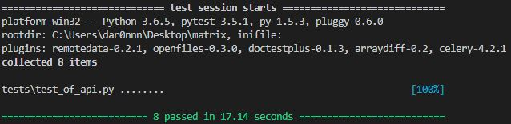

# Агент в мультиагентной системе

Данный репозиторий содержит в себе функционал контроллера, который должен обеспечивать сохранение данных в системе при изменении количества контроллеров и других внештаных ситуациях.

Это вторая его версия, построенная на открытых и пока не сертефицированных фреймворках

Если кратко: контроллер - это интеллектуальный агент, созданный для мультиагентной системы.

Некоторые функции были удалены из за NDA
Данный контроллер написан для использования в системах, сертефицированных ФСТЭК.
Необходима доработка его в некоторых частях, в частности в местах межсетевых взаимодействий. Планировался переход на Celery или Tornado. Пока разработка заморожена.

index.html недоделан и писался не мной.

* Версия Python: 3.6.5
* Версия PostgreSQL: 10
* Flask
* SQLAlchemy

